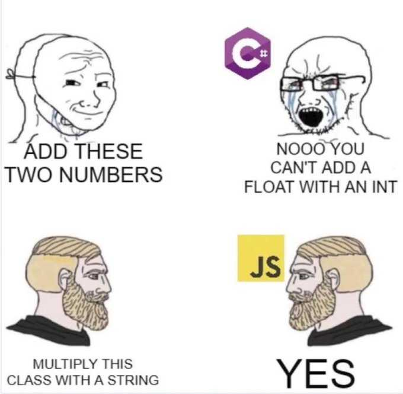

<h1 align="center">hi, im makaron</h1>

  ```
  hello.world("console log!");       // Uncaught ReferenceError: hello is not defined
  ```


<p align="center">
  
</p>

---

## things i can use

<div align="left">
  
  
  
  
  
  
  
  
</div>

---

## tools ect.

<div align="left">
   
  
  
  
  
   
  
  
  
  
  
  
  
  
  
  
  
</div>

---

## JAVASCRIPT SUPREMACY CORNER

<div align="center">
  
  
  
</div>

---

## recently listened to

<div align="center">
  <a href="https://open.spotify.com/user/ub49jctpqsbsx4q0e3ezww295">
    
  </a>
</div>

---

## profile views

<div align="center">
  
</div>
